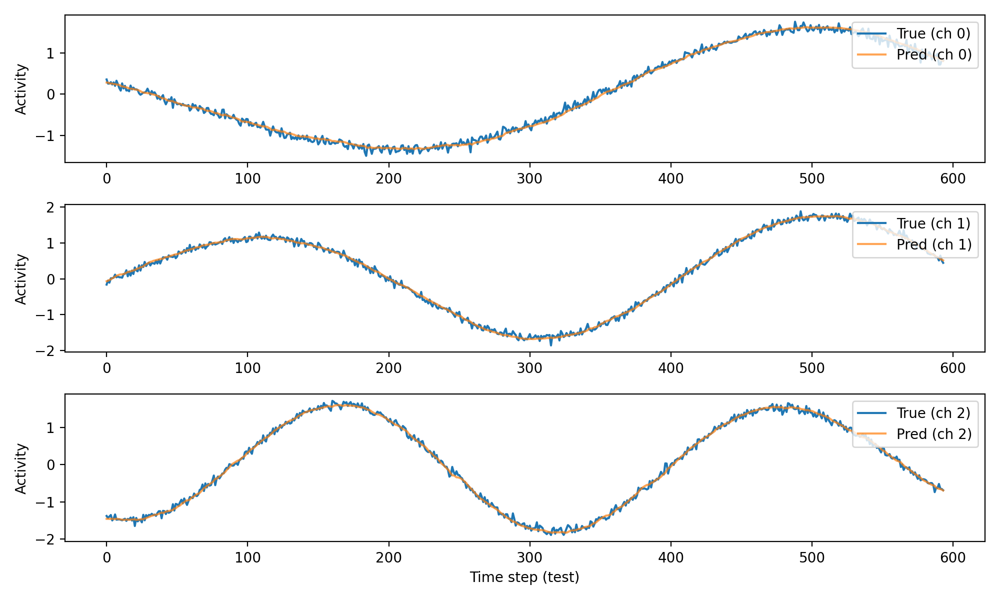

# Brain Dynamics Forecasting Using LSTM (Course Challenge)

This project implements **Neural Time-Series Forecasting** for synthetic brain activity signals using a **Long Short-Term Memory (LSTM)** network.

It satisfies the deliverables of the **Course Challenge (Option 2: AI for Brain Dynamics)** by:

- generating realistic multi-channel brain-like signals  
- training an LSTM to model and predict neural activity  
- evaluating the model using MSE and R² metrics  
- visualizing predictions vs ground truth  
- providing a clear reproducible implementation  

---

# 1. Problem Description

Brain activity can be represented as multivariate time-series signals.  
Forecasting future activity is important in neuroscience for:

- neural decoding  
- seizure prediction  
- modeling cortical dynamics  
- brain-computer interfaces  

In this project, we simulate **synthetic brain activity** using coupled oscillators and train an **LSTM neural network** to predict the next time step of all brain channels.

---

# 2. Mathematical Model

We generate a signal:

\[
X(t) \in \mathbb{R}^C
\]

where each channel is:

\[
x_k(t) = \sin(\omega_k t + \phi_k) 
\]

with:

- different frequencies \( \omega_k \)
- random phases \( \phi_k \)
- cross-channel coupling  
- added Gaussian noise  

This creates realistic oscillatory neural activity.

We normalize each channel to zero mean and unit variance.

---

# 3. Data Pipeline

### Step 1 — Generate multichannel signal:

\[
X = [x_1(t), x_2(t), ..., x_C(t)] \in \mathbb{R}^{T \times C}
\]

### Step 2 — Convert to supervised sequences:

Given past `seq_len` time steps:

\[
[X(t-seq\_len), ..., X(t-1)]
\]

the model predicts the next step:

\[
X(t)
\]

This results in:

- `X_train`: (N, seq_len, C)  
- `y_train`: (N, C)

---

# 4. Neural Network Architecture

The LSTM model:

Input → LSTM(64 units) → FC → Output (C channels)


- Input size = number of brain channels  
- Output size = number of brain channels  
- Loss function: **Mean Squared Error (MSE)**  
- Optimizer: **Adam**  
- Learning rate: 0.001  

---

# 5. Training & Metrics

We train for **30 epochs** with batch size **32**.

We compute:

### ✔ Overall MSE  
### ✔ Per-channel MSE  
### ✔ Per-channel R² score

R² close to 1 indicates near-perfect forecasting.

---

# 6. Results

The model learns the dynamics extremely well.

### True vs Predicted time traces:


### Heatmap of all channels (test set):
Left = Ground Truth  
Right = LSTM Prediction  


### Example metrics:
Per-channel MSE: [0.0049, 0.0045, 0.0050, 0.0051, 0.0057]
Per-channel R²: [0.9953, 0.9906, 0.9960, 0.9961, 0.9950]


This shows the LSTM successfully captures temporal + spatial correlations in the synthetic brain data.

---

# 7. How to Run

Install requirements:

```bash
py -m pip install torch numpy matplotlib
