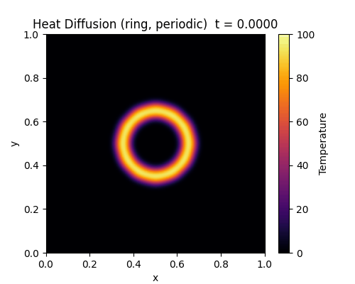

# 2D Heat Diffusion Simulation (Numerical Methods Project)

This project simulates **heat diffusion on a 2D metal plate** using numerical methods (finite differences + explicit Euler).  
It includes several initial heat patterns, multiple boundary conditions, and a GIF animation export.

---

## 1. Overview

Heat diffusion describes how temperature spreads from hot regions to cold regions over time.  
We model a square plate using the **2D heat equation**, discretised on a grid.

Main features:
- 2D heat equation solved numerically  
- Initial patterns: **square**, **circle**, **two spots**, **ring**  
- Boundary conditions: **fixed**, **insulated**, **periodic**  
- Real-time simulation (`heat_diffusion.py`)  
- GIF animation exported using (`heat_video.py`)  

The **main demo** uses:
- Initial pattern: **ring**  
- Boundary condition: **periodic**

This produces a smooth, visually impressive diffusion animation.

---

## 2. Mathematical Model

We solve the **2D heat equation**:

\[
\frac{\partial u}{\partial t} = \alpha \left(
\frac{\partial^2 u}{\partial x^2} +
\frac{\partial^2 u}{\partial y^2}
\right)
\]

Where:

- \(u(x,y,t)\) is temperature  
- \(\alpha\) is thermal diffusivity  
- \(x,y\) are spatial coordinates  

### Initial condition (ring)

The plate is initially cold except for a ring-shaped hot region:

- temperature = 100 inside the ring  
- elsewhere = 0  

### Boundary conditions

The simulation supports:

**1. Fixed (Dirichlet)**  
Edges kept at 0°C.

**2. Insulated (Neumann)**  
Zero heat flux across edges.

**3. Periodic**  
Opposite edges are connected (torus surface).  
Used for the main animation.

---

## 3. Numerical Method

### Spatial discretisation
The domain is divided into a grid of \(N_x \times N_y\) points.  
Second derivatives are approximated using **central finite differences**:

\[
u_{xx} \approx \frac{u_{i+1,j} - 2u_{i,j} + u_{i-1,j}}{\Delta x^2}
\]

\[
u_{yy} \approx \frac{u_{i,j+1} - 2u_{i,j} + u_{i,j-1}}{\Delta y^2}
\]

### Time discretisation
We use the **forward Euler method**:

\[
u^{n+1} = u^n + \Delta t \cdot \alpha (u_{xx} + u_{yy})
\]

### Stability condition

\[
\Delta t \le \frac{\Delta x^2}{4\alpha}
\]

In the code:

```python
dt = 0.2 * dx**2
```

which satisfies the stability requirement.

---

## 4. Implementation

### Files

- `heat_diffusion.py` — Interactive simulation you can watch in real time  
- `heat_video.py` — Creates the GIF animation  
- `heat_diffusion_demo.gif` — Generated animation  
- `README.md` — Project documentation (this file)

### Important functions

- `init_temperature()` — creates the initial ring pattern  
- `step(u)` — performs one update step of the PDE  
- `run_simulation()` — runs the real-time animation  
- `run_video()` — produces the final GIF

---

## 5. How to Run

### Install requirements:

```bash
py -m pip install numpy matplotlib pillow
```

### Run the interactive simulation:

```bash
py heat_diffusion.py
```

### Generate the GIF:

```bash
py heat_video.py
```

This creates:

```
heat_diffusion_demo.gif
```

---

## 6. Results

### Main demo: ring + periodic boundary condition

Below is the GIF of the final animation:



This shows:
- a hot ring diffusing smoothly  
- heat wrapping around the edges due to periodic boundaries  
- final equilibrium where temperature becomes uniform  

---

## 7. Project Structure

```
proiect/
├── heat_diffusion.py
├── heat_video.py
├── heat_diffusion_demo.gif
└── README.md
```

---

## 8. Author

- **Name:** <Grecu Mihai-Stefan>  
- **Course:** Numerical Methods  
- **Year:** 2025  

